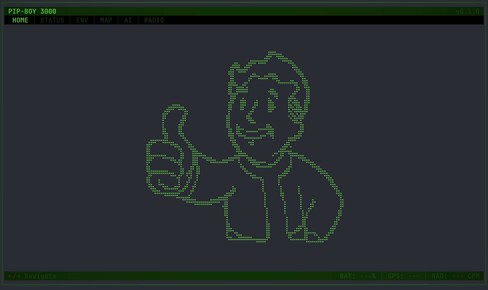
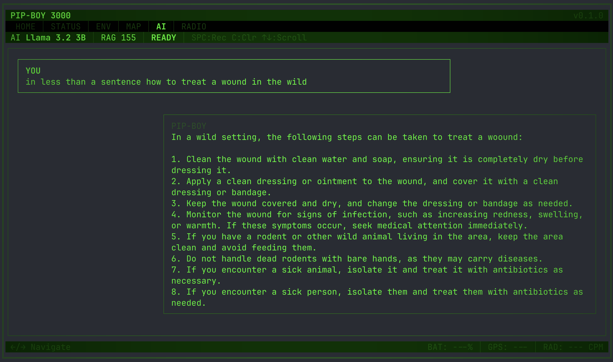
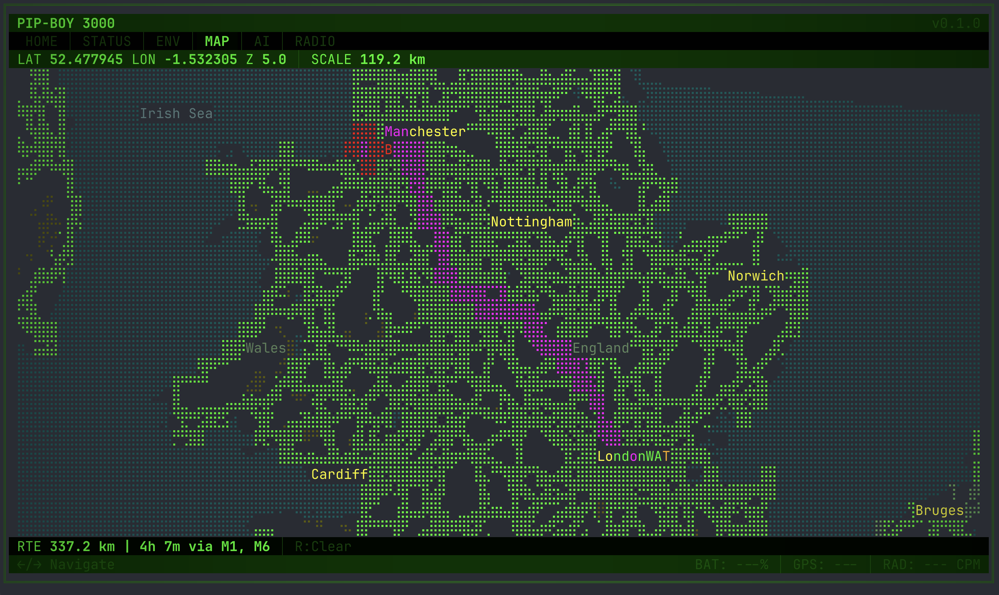

# PIP-BOY 3000

A Fallout-inspired wearable computer built on a Raspberry Pi 5, featuring a terminal UI with survival AI assistant, vector maps, voice control, and environmental sensors.



## Features

**AI Assistant** - Local LLM (Llama 3.2 3B) with RAG knowledge base covering survival, medical, farming, foraging, and more. Voice input via Whisper STT.



**Vector Map** - Real-time vector tile rendering in braille unicode. Geocoding with phonetic STT correction, turn-by-turn routing, offline .mbtiles support.



**Tabs** - HOME, STATUS, ENV (sensors), MAP, AI, RADIO

## Stack

- **UI**: [OpenTUI](https://github.com/anomalyco/opentui) - terminal UI framework
- **Runtime**: [Bun](https://bun.sh)
- **LLM**: [llama.cpp](https://github.com/ggerganov/llama.cpp) + Llama 3.2 3B Instruct (Q4_K_M)
- **STT**: [whisper.cpp](https://github.com/ggerganov/whisper.cpp) + Whisper base.en
- **Maps**: OpenStreetMap vector tiles (Protobuf), Nominatim geocoding, OSRM routing
- **Hardware target**: Raspberry Pi 5 (8GB) + 4" ePaper display

## Quick Start

```bash
# Install dependencies
make setup

# Download AI models (~2GB LLM + ~142MB Whisper)
make setup-ai

# Run in dev mode (hot reload)
make dev
```

## Controls

| Key | Action |
|-----|--------|
| Left/Right | Switch tabs |
| Space | Push-to-talk (AI tab) |
| C | Clear chat (AI tab) |
| Up/Down | Scroll chat / pan map |
| +/- | Zoom map |
| R | Clear route (MAP tab) |

## Voice Commands (MAP tab)

- "Where is [place]" - geocode and jump to location
- "Navigate to [place]" - show route from current position
- "Navigate from [A] to [B]" - show route between places
- "Zoom in / zoom out"
- "Clear route"

## Project Structure

```
pip-boy/
  Makefile              # Setup, build, model download
  pip-boy-tui/
    src/
      index.ts          # Main TUI app
      ai/
        llm-client.ts   # LLM streaming client
        rag.ts          # Vector-free RAG (TF-IDF)
        stt.ts          # Whisper STT wrapper
      map/
        renderer.ts     # Braille vector tile renderer
        geocoder.ts     # Smart geocoding with LLM correction
        router.ts       # OSRM routing client
        tile-source.ts  # Online + offline .mbtiles tile fetching
    data/knowledge/     # RAG knowledge base (survival docs)
  ai-models/            # (gitignored) llama.cpp, whisper.cpp, model files
  plan.md               # Hardware + software planning docs
```

## Hardware (planned)

Raspberry Pi 5 (8GB), 4" ePaper display, BME280, UV sensor, Geiger counter, GPS, RTC, LiPo battery, I2S mic + speaker, rotary encoder, 3D printed enclosure.

See `plan.md` for the full component list and architecture.

## License

Personal project. Not affiliated with Bethesda or the Fallout franchise.
